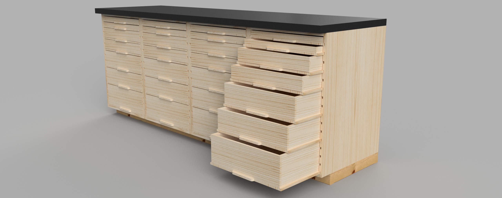

# DIY Utility Drawers

## Description
This DIY Utility Drawers project offers a streamlined approach to creating versatile storage units that resemble kitchen cabinets but are optimized for workshop environments.
The design leverages simple construction techniques suitable for both novice and experienced DIY enthusiasts, focusing on functionality and ease of assembly.

## Project Goals
The aim of this project is to provide a cost-effective, durable, and aesthetically pleasing storage solution for workshops, garages, or even home offices where utility and space optimization are key. By following this guide, users will be able to craft a set of high-quality drawers that are both functional and stylish, without the complexities and costs associated with traditional cabinet making.

## Design Features

### Hardware-Free Slides
Each drawer features integrated "wings" that slide into dedicated slots on the sides of the cabinet, eliminating the need for metal hardware. This design not only reduces cost, but also simplifies the construction process, enhances the durability and eases of maintenance of the drawers.

### Kitchen Cabinet-Esque Aesthetics
The drawers mimic the clean lines and functional design of traditional kitchen cabinets, making them an attractive addition to any workshop space.

### Standardized Dimensions
The overall structure is designed to fit typical computer cabinet dimensions, making these drawers ideal for integrating into existing workshop layouts or alongside other standard equipment.

### Modular Drawer Heights
Drawer heights are designed in multiples of 1U, 1.75 inches, allowing for customizable storage solutions that can accommodate a variety of tools and materials.

## Construction Details
1. **Materials Needed:** Plywood, wood glue, screws, and finishing materials such as paint or varnish. A full bill of materials can be found [here](4-cabinet-counter-bom.md).
1. **Tools Required:** Circular or table saw, drill, and sanding tools.
1. **Assembly Instructions:** (Coming soon!) Step-by-step instructions will guide you through the process of measuring, cutting, and assembling the drawers and cabinet frame. Diagrams will provide visual aid to ensure clarity and accuracy. The current version of the assembly instructions can be found [here](assembly-instructions.md).
