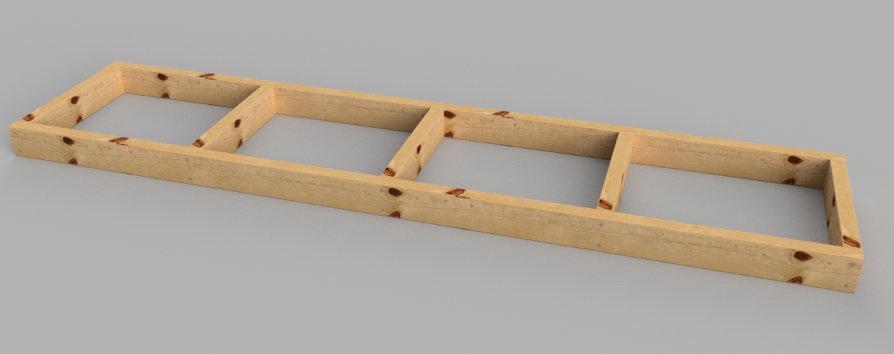
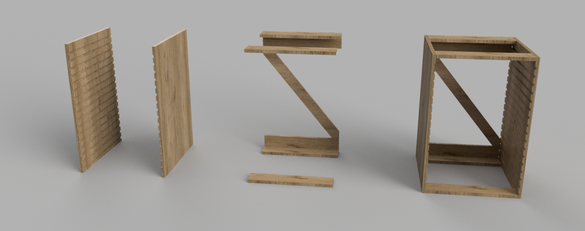
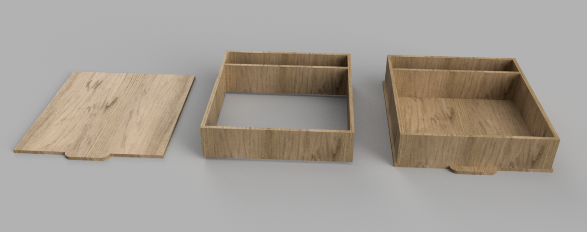

# Utility Drawers Build

## Footer

1. Cut the two long pieces of 2"x4"s
1. Cut the five short pieces of 2"x4"s
1. Screw together using the 2 1/2" wood screws

## Frames

1. Sides
    1. Cut the frame sides
    1. Route the drawer slots
    1. Use a 9/16" router bit
    1. Depth is 1/4"
    1. The bottom of the first slot is 1 3/4" from the bottom of the frame
    1. Subsequent slots have 1 3/4" spacing
1. Stringers
    1. Cut all stringers to length
    1. Drill pocket holes in the ends of each stringer
1. Glue and screw the stringers to the sides
1. Diagonal Brace
    1. Cut the brace long
    1. With the frame face down, align the brace on the back of the frame
    1. Trace the lines for cutting the brace
    1. Glue and screw the brace in place

## Drawers

1. Cut drawer bottoms
1. Cut side rabbets and front/back dados
1. Cut false back (optional)
1. Glue and tack sides, front, back and false back to form the box
1. Glue and tack bottom to the box
