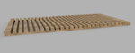
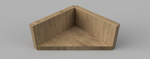

# DIY Utility Drawer Mods
Got a cool mod for the Utility Drawers?
Have a custom jig or tool for building them?
Add you mod here to share with others!

## Adding Your Mod
1. Fork this repo
1. In the user-mods folder, add a folder with your mod
1. Add a README.md, images, CAD files, etc. to your folder
1. If adding a CAD file, please include a STEP since not everyone has Fusion or SolidWorks
1. Thumbnails should be 150px wide
1. Update the table on this page with your mod's details
1. Keep the table sorted by Mod Name
1. Create a pull request

## User Mods
||Mod|Description|Created By|
|-|-|-|-|
||[Cab Side Jig](cab-side-jig/README.md)|A router template/jig for routing the channels into the cabinet sides|[tallman5](https://github.com/tallman5)|
||[Stretcher Brace](stretcher-brace/README.md)|A simple brace for attaching stretchers to the cabinet sides|[tallman5](https://github.com/tallman5)|
