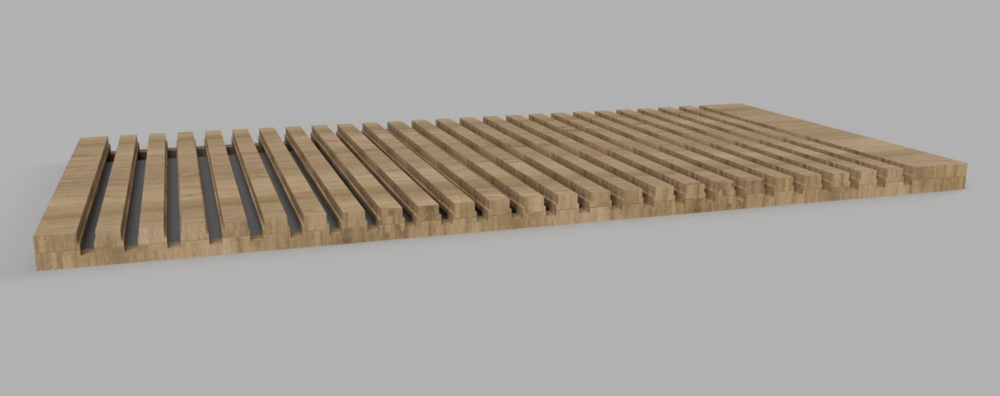

# Cabinet Side Template

This jig is a template for routing the channels into the sides of the cabinets.
It's meant to be used with a 3/4" router template guide.
While it will take some time to make the jig, routing the cabinet sides will be considerably easier.
The frame is made from the same plywood as the cabinet sides.

## Building the Jig

1. Cut a panel from the same material as the cabinet sides, make it 2" taller and 2" wider.
1. Mount 1" strips around the outside of the panel.
1. Place a 3/4" bit on the router.
1. Use a track guide or similar and route the channel guides.

## Using the Jig

1. Align the jig on one of the cabinet sides and clamp in place.
1. Mount a 3/4" outside diameter template guide to the router.
1. Use a centering cone to ensure the accuracy.
1. Use a 5/8" straight router bit. A 9/16" bit will alow work, however it will have less room for error when cutting the drawer bottoms.
1. Route away!
