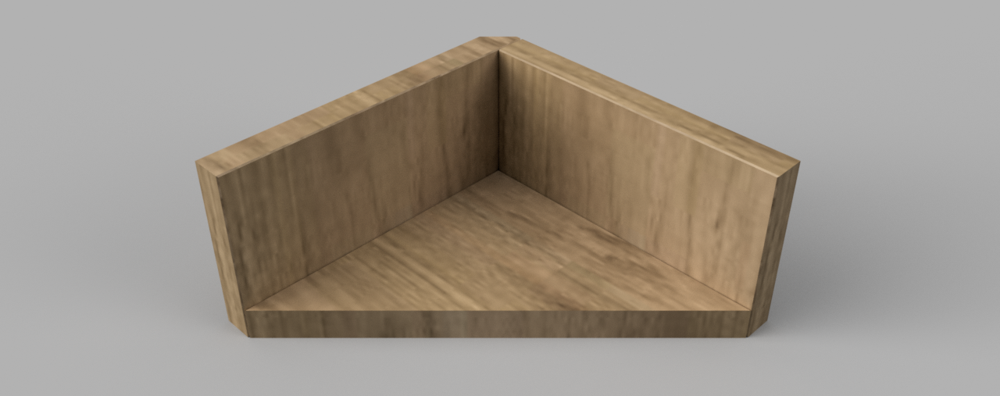

# Stretcher Brace

This jig is a simple brace to hold a stretcher at 90 degrees to the cabinent side while attaching a stretcher.
It's made with scraps from the 3/4" plywood sheets.

## Using the Jig

1. Position the jig on the end of a stretcher.
1. Clamp one side to the stretcher.
1. Clamp the other side to the cabinet side.
1. Fasten the stretcher.
